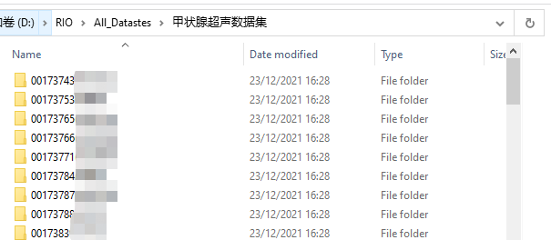
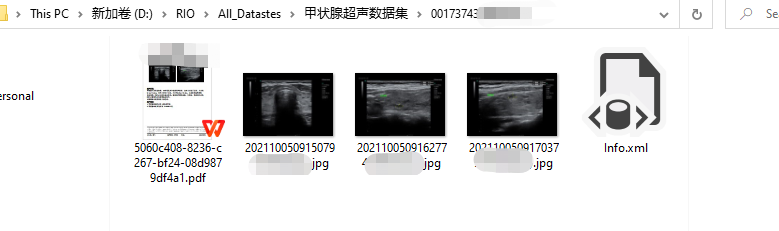

# 医学报告生成—临床数据处理

## 1. 实际临床医学报告格式概述

在和医生进行沟通后，医院可以练习影像科导出患者的数据，医生直接导出的数据格式如下。以甲状腺数据为例，该文件夹下包含着每个患者的报告信息及图像信息，文件夹以患者的 **“UID+姓名”** 命名

每个患者文件夹下包含(患者的PDF报告，检测时的多张图像，info.xml)

- info.xml存储着PDF中的报告文字及患者的相关信息（年龄、性别、患者主诉、检查医生等等）

## 2. 报告处理思路

- 由于info.xml并没有存储报告上对应图像的地址，因此直接提取报告上的图像作为目标图像。
- 提取图像之后使用图像处理方法提取报告中的最大矩形区域作为中心图像，去除多余无用信息
- 提取XML中的报告及患者其他信息

此份代码处理了3个不同部位的超声数据集（甲状腺、乳腺、肝脏）。